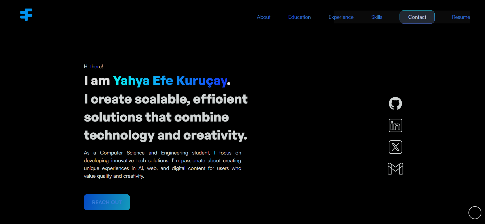
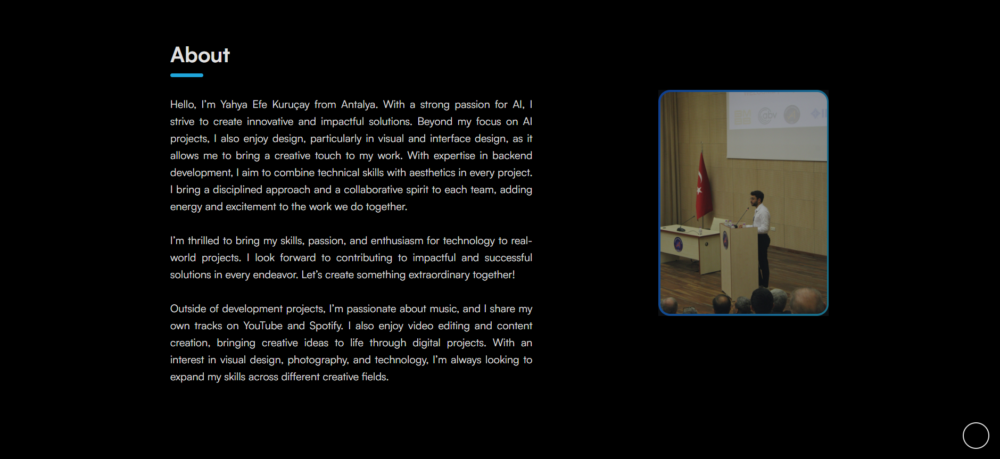

# Personal Portfolio Website

<div align="center">
  
  
</div>

## 📌 Overview

This is my personal portfolio website showcasing my professional journey, projects, and skills. The website is designed to be fully responsive and provides an interactive user experience across all devices.

## 🚀 Features

- Modern and clean design
- Fully responsive layout
- Interactive UI elements
- Project showcase
- Skills section
- Contact form
- Dark/Light mode toggle
- Smooth scrolling
- Cross-browser compatibility

## 🛠 Technologies Used

- HTML5
- CSS3
- JavaScript
- Font Awesome Icons
- Google Fonts
- Responsive Design
- CSS Animations
- CSS Grid & Flexbox

## 🔧 Setup and Installation

1. Clone the repository:
```bash
git clone https://github.com/efekurucay/Portfolio-Website-V1.git
```

2. Navigate to the project directory:
```bash
cd Portfolio-Website-V1
```

3. Open the `index.html` file in your preferred browser.

## 🌐 Live Demo

Visit the live website: [efekurucay.com](https://efekurucay.com)

## 📱 Responsive Design

The website is fully responsive and optimized for:
- Desktop devices
- Tablets
- Mobile phones

## 🤝 Contributing

Contributions, issues, and feature requests are welcome! Feel free to check [issues page](https://github.com/efekurucay/Portfolio-Website-V1/issues).

## 📝 License

This project is licensed under the MIT License - see the [LICENSE](LICENSE) file for details.

## 👤 Contact

If you want to contact me, you can reach me through:
- Email: contact@efekurucay.com
- [LinkedIn](https://linkedin.com/in/efekurucay24)
- [GitHub](https://github.com/efekurucay)

## ⭐ Acknowledgments

- Original design inspiration from [Krish Depani](https://github.com/Krish-Depani)
- Icons provided by Font Awesome
- Fonts from Google Fonts

---
<div align="center">
Made with ❤️ by Yahya Efe Kuruçay
</div>
